> **HỌC VIỆN CÔNG NGHỆ BƯU CHÍNH VIỄN THÔNG CƠ SỞ THÀNH PHỐ HỒ CHÍ
> MINH**
>
> **KHOA CÔNG NGHỆ THÔNG TIN II**
>
> **-------------\*-------------**

BÀI TẬP NHÓM

Đề tài: Thiết kế Website giới thiệu trường đại học

> **Môn học** : Lập trình Web
>
> **Giảng viên hướng dẫn** : Nguyễn Văn Hữu Hoàng
>
> **Sinh viên thực hiện** : Phạm Hùng Thiên - N22DCCN180

Nguyễn Ngọc Phú - N22DCCN159

***<u>TP.Hồ Chí Minh, tháng 04 năm 2025</u>***

**Phần I: Thiết kế**

**1. Trang Tổng Quan**

Trang này cung cấp các thông tin thống kê nhanh về hoạt động kinh doanh:

-   Số liệu doanh thu, đơn hàng, khách hàng theo tuần.

-   Biểu đồ doanh thu theo ngày.

-   Danh sách sản phẩm phổ biến.

-   Bảng đơn hàng gần nhất.

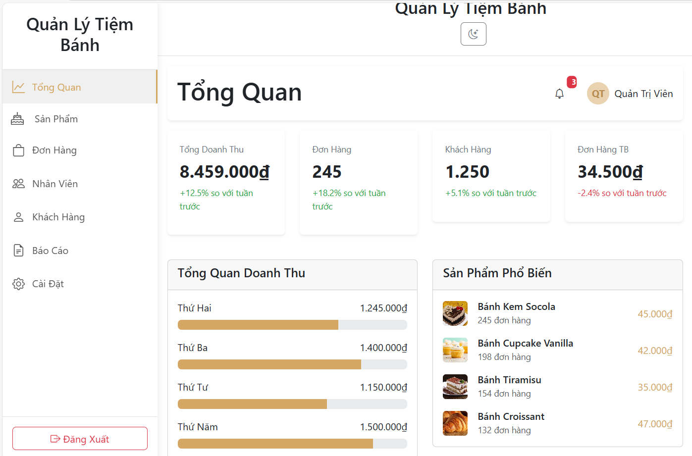

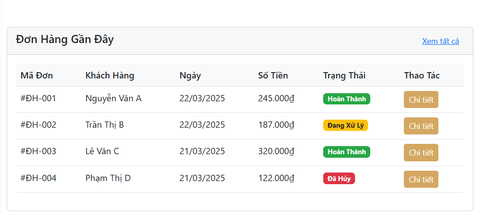

**2. Trang Sản Phẩm**

Trang này hiển thị danh sách sản phẩm theo tên, danh mục, giá, tồn kho,
trạng thái (còn/hết/sắp hết hàng), cho phép sửa và xóa nhanh.

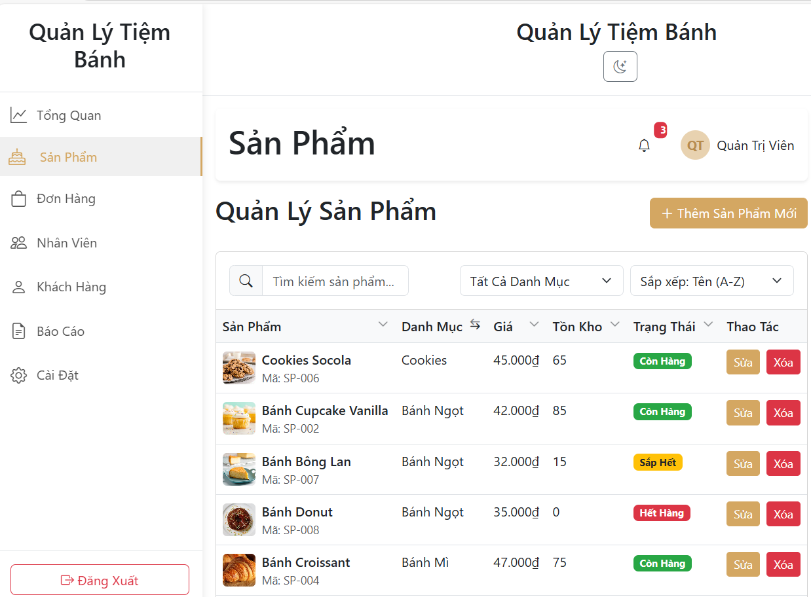

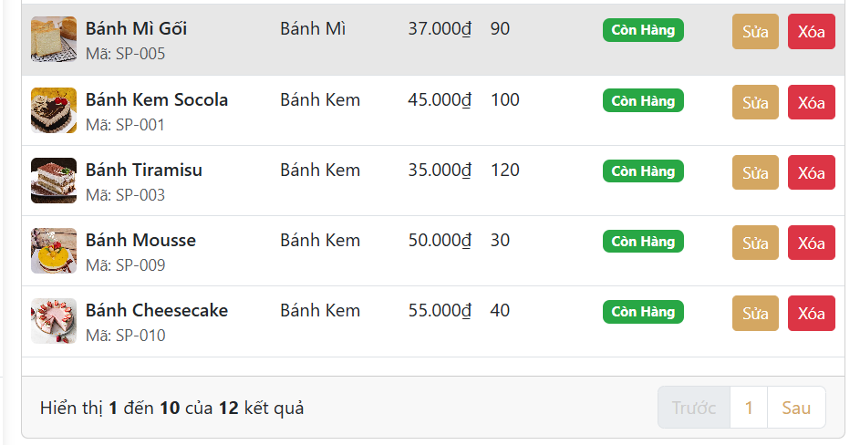

**3. Trang Đơn Hàng**

Quản lý tất cả các đơn hàng theo mã, tên khách, ngày, tổng tiền, trạng
thái (hoàn thành, đang xử lý, hủy), cho phép xem chi tiết, in đơn hàng
hoặc hủy.

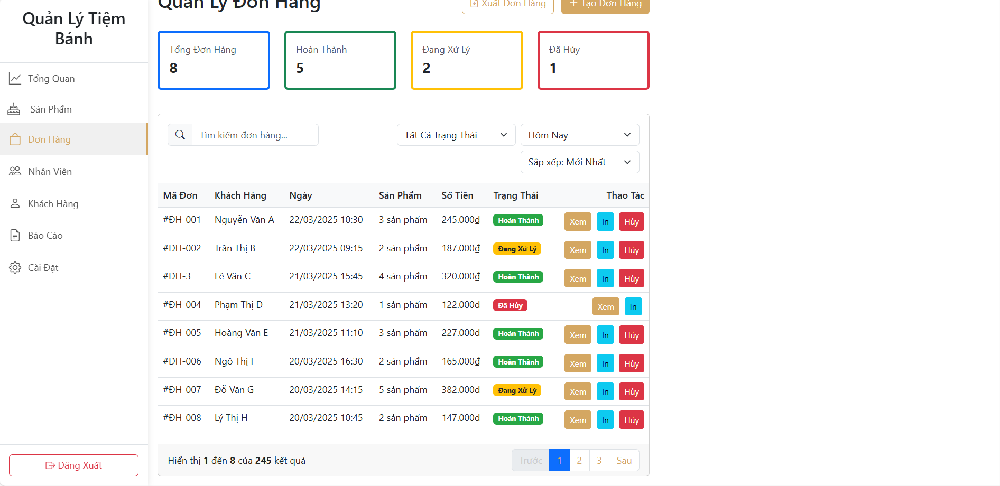

**4. Trang Nhân Viên**

Trang liệt kê toàn bộ nhân viên theo tên, vị trí, email, ngày vào làm,
trạng thái (nghỉ phép, đang làm), cho phép sửa, lịch trực, xóa nhanh.

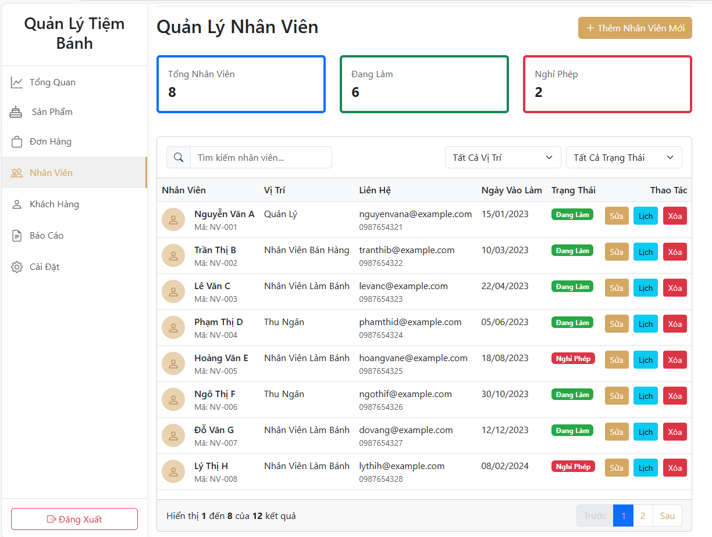

**5. Trang Khách Hàng**

Hiển thị danh sách khách hàng có thông tin giao dịch, liên hệ, số đơn,
chi tiêu, phân loại theo VIP, mới, thường xuyên...

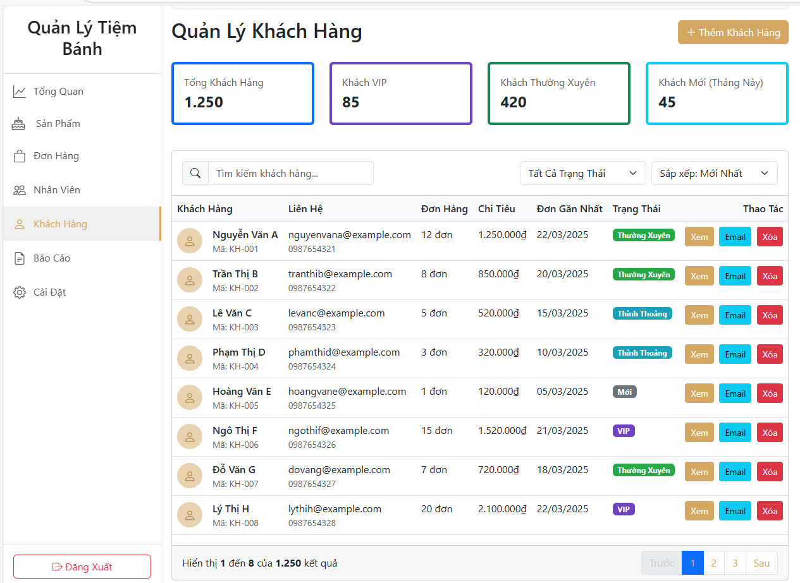

**6. Trang Báo Cáo**

Tổng hợp các số liệu kinh doanh theo danh mục, theo thời gian, doanh thu
theo tháng, top sản phẩm bán chạy, tăng trưởng...

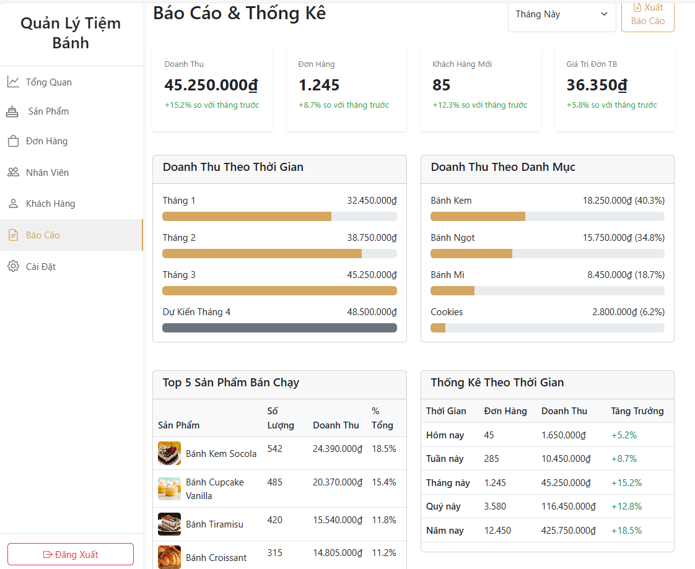

**7. Trang Cài Đặt**

Thiết lập thông tin cửa hàng, địa chỉ, email, VAT, phương thức thanh
toán hỗ trợ (tiền mặt, thẻ, MoMo, ZaloPay).

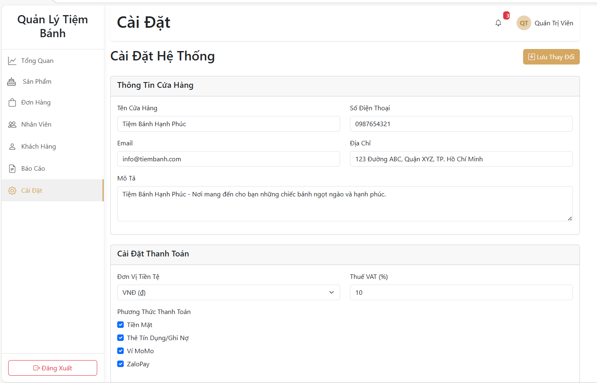

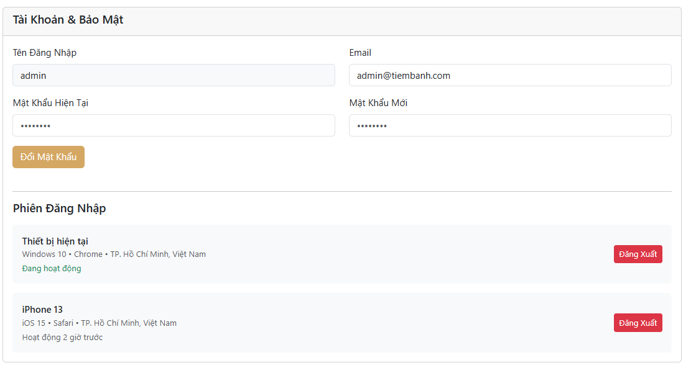

**8. Chế độ sáng/tối (Light/Dark Mode)**

Chức năng chuyển đổi giữa giao diện sáng và tối được tích hợp nhằm tăng
trải nghiệm người dùng. Giao diện tối giúp giảm mỏi mắt khi làm việc vào
ban đêm, giao diện sáng phù hợp với môi trường ban ngày. Chế độ này có
thể được bật/tắt dễ dàng thông qua nút chuyển trên thanh điều hướng.

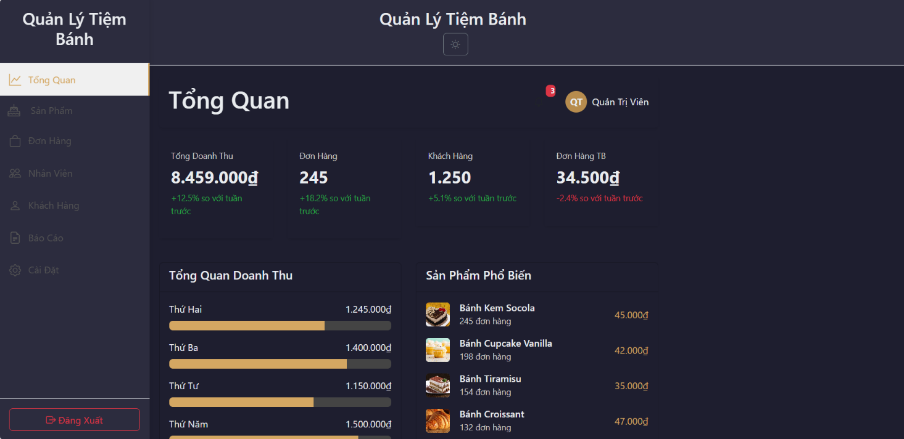

<table>
<colgroup>
<col style="width: 8%" />
<col style="width: 54%" />
<col style="width: 36%" />
</colgroup>
<thead>
<tr class="header">
<th>STT</th>
<th>Nội dung thực hiện</th>
<th>Sinh viên</th>
</tr>
</thead>
<tbody>
<tr class="odd">
<td>1</td>
<td>Thiết kế giao diện trang Tổng Quan, Sản phẩm, Đơn hàng</td>
<td>Phạm Hùng Thiên</td>
</tr>
<tr class="even">
<td>2</td>
<td>Thiết kế trang Nhân viên, Khách hàng, Báo cáo, Cài đặt</td>
<td>Nguyễn Ngọc Phú(NT)</td>
</tr>
<tr class="odd">
<td>3</td>
<td>Hoàn thiện giao diện, chỉnh sửa code, viết báo cáo</td>
<td>Cả hai cùng thực hiện</td>
</tr>
</tbody>
</table>
